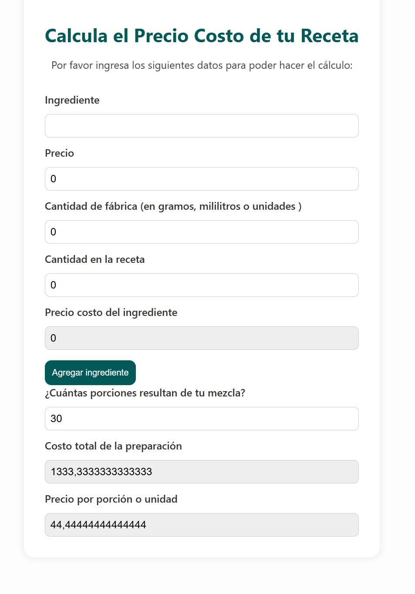

# TuRecetaApp 🍲

Una aplicación para calcular el costo de los ingredientes de una receta, desarrollada con React.

## Tecnologías usadas

- React
- JavaScript
- HTML / CSS

## Funcionalidades

- Agregar ingredientes con precio y cantidad.
- Calcular costo total según cantidades en la receta.
- Interfaz simple y clara.

## Cómo usar

1. Cloná el repositorio
2. Ejecutá `npm install`
3. Luego `npm start`

---

Desarrollado por [@Xgsusbrx](https://github.com/Xgsusbrx)
